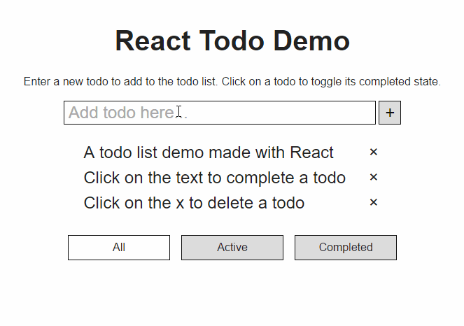

# react-todo-demo

A todo list demo made with React and includes unit and integration tests. An
interactive demo can be found on
[Codepen](https://codepen.io/paulkim/full/mRVGbO/).



## Getting started

Clone the git repo:

```
git clone https://github.com/paulmskim/react-todo-demo.git
```

Install node modules:

```
npm install
```

Run webpack dev server with `npm run dev` and visit http://localhost:8080.

## Testing

To run unit tests, run:

```
npm run unit-test
```

Coverage of components can be see in `/coverage`.

To run integration tests, run:

```
npm run integration-test
```
